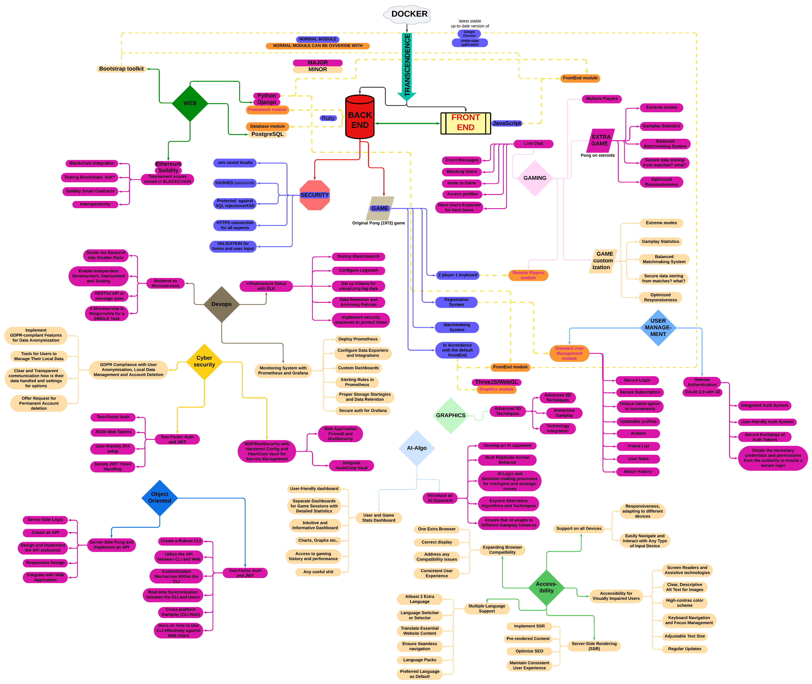

# Transcendence

# First Part #
## To-do part 1 ##
### Minimal Technical requirement
- [ ] Docker: docker-compose up --build (rootless mode for security)
- [ ] Backend Module ruby -> Django (Backend module)
- [ ] Database -> PostGre (Database module) 
- [ ] Frontend Module vanilla -> bootstrap (FrontEnd module)
- [ ] Single page
- [ ] Google chrome latest stable up-to-date version
### Game Pong
- [ ] Pong, same keyboard input (Remote player module)
- [ ] propose a tournament
- [ ] registration system (standard user management module)
- [ ] matchmaking system
- [ ] (AI Module)
- [ ] (front-end module)
- [ ] (Graphics module)
- [ ] ness test
### Security
- [ ] Hashing (in database for password)
- [ ] Protection SQL injections/XSS
- [ ] HTTPS
- [ ] Validation form for user input on the server side.
- [ ] .env file must be out.

Total score: 30%

# Second Part #
## To-do part 2
### WEB #
### Major module: Use a Framework as backend. +10
- [ ] Django.
### Minor module: Use a front-end framework or toolkit. +5
- [ ] Bootstrap
### Minor module: Use a database for the backend. +5
- [ ] PostgreSQL
### User Management #
### Major module: Standard user management, authentication, users across tournaments. +10
- [ ] Users can subscribe to the website in a secure way.
- [ ] Registered users can log in in a secure way.
- [ ] Users can select a unique display name to play the tournaments.
- [ ] Users can update their information.
- [ ] Users can upload an avatar, with a default option if none is provided.
- [ ] Users can add others as friends and view their online status.
- [ ] User profiles display stats, such as wins and losses.
- [ ] Each user has a Match History including 1v1 games, dates, and relevant details, accessible to logged-in users.
### Major module: Implementing a remote authentication. +10
- [ ] Integrate the authentication system, allowing users to securely sign in.
- [ ] Obtain the necessary credentials and permissions from the authority to enable a secure login.
- [ ] Implement user-friendly login and authorization flows that adhere to best practices and security standards.
- [ ] Ensure the secure exchange of authentication tokens and user information between the web application and the authentication provider.
### Gameplay and user Experience #
### Major module: Remote players. +10
- [ ] It is possible to have two distant players. Each player is located on a separated computer, accessing the same website and playing the same Pong game.
### Major module: Add Another Game with User History and Matchmaking. +10
- [ ] Develop a new, engaging game to diversify the platform’s offerings and entertain users.
- [ ] Implement user history tracking to record and display individual user’s gameplay statistics.
- [ ] Create a matchmaking system to allow users to find opponents and participate in fair and balanced matches.
- [ ] Ensure that user game history and matchmaking data are stored securely and remain up-to-date.
- [ ] Optimize the performance and responsiveness of the new game to provide an enjoyable user experience. Regularly update and maintain the game to fix bugs, add new features, and enhance gameplay.
### Minor module: Game Customization Options. +5
- [ ] Offer customization features, such as power-ups, attacks, or different maps, that enhance the gameplay experience.
- [ ] Allow users to choose a default version of the game with basic features if they prefer a simpler experience.
- [ ] Ensure that customization options are available and applicable to all games offered on the platform.
- [ ] Implement user-friendly settings menus or interfaces for adjusting game parameters.
- [ ] Maintain consistency in customization features across all games to provide a unified user experience.
### Major module: Live chat. +10
- [ ] The user should be able to send direct messages to other users.
- [ ] The user should be able to block other users. This way, they will see no more messages from the account they blocked.
- [ ] The user should be able to invite other users to play a Pong game through the chat interface.
- [ ] The tournament system should be able to warn users expected for the next game.
- [ ] The user should be able to access other players profiles through the chat interface.
### IA - Algo #
### Major module: Introduce an AI Opponent. +10
- [ ] !A*

### Cybersecurity #
### Major module: Implement Two-Factor Authentication (2FA) and JWT. +10
- [ ] Implement Two-Factor Authentication (2FA) as an additional layer of security for user accounts, requiring users to provide a secondary verification method, such as a one-time code, in addition to their password.
- [ ] Utilize JSON Web Tokens (JWT) as a secure method for authentication and authorization, ensuring that user sessions and access to resources are managed securely.
- [ ] Provide a user-friendly setup process for enabling 2FA, with options for SMS codes, authenticator apps, or email-based verification
- [ ] Ensure that JWT tokens are issued and validated securely to prevent unauthorized access to user accounts and sensitive data.

### Graphics #
### Major module: Use of advanced 3D techniques. +10
- [ ] Advanced 3D Graphics: The primary goal of this module is to implement advanced 3D graphics techniques to elevate the visual quality of the Pong game. By utilizing ThreeJS/WebGL , we aim to create stunning visual effects that immerse players in the gaming environment.
- [ ] Immersive Gameplay: The incorporation of advanced 3D techniques enhances the overall gameplay experience by providing users with a visually engaging and captivating Pong game.
- [ ] Technology Integration: The chosen technology for this module is ThreeJS/WebGL . These tools will be used to create the 3D graphics, ensuring compatibility and optimal performance.
### Accessibility #
### Minor module: Support on all devices. +5
- [ ] Make sure the website is responsive, adapting to different screen sizes and orientations, ensuring a consistent user experience on desktops, laptops, tablets, and smartphones.
- [ ] Ensure that users can easily navigate and interact with the website using different input methods, such as touchscreens, keyboards, and mice, depending on the device they are using.
### Minor module: Expanding Browser Compatibility. +5
- [ ] Extend browser support to include an additional web browser, ensuring that users can access and use the application seamlessly.
- [ ] Conduct thorough testing and optimization to ensure that the web application functions correctly and displays correctly in the newly supported browser.
- [ ] Address any compatibility issues or rendering discrepancies that may arise in the added web browser.
- [ ] Ensure a consistent user experience across all supported browsers, maintaining usability and functionality.
### Minor module: Multiple language supports. +5
- [ ] Implement support for a minimum of three languages on the website to accommodate a broad audience.
- [ ] Provide a language switcher or selector that allows users to easily change the website’s language based on their preferences.
- [ ] Translate essential website content, such as navigation menus, headings, and key information, into the supported languages.
- [ ] Ensure that users can navigate and interact with the website seamlessly, regardless of the selected language.
- [ ] Consider using language packs or localization libraries to simplify the translation process and maintain consistency across different languages.
- [ ] Allow users to set their preferred language as a default choice for subsequent visits to the website.

Total score: 120%
